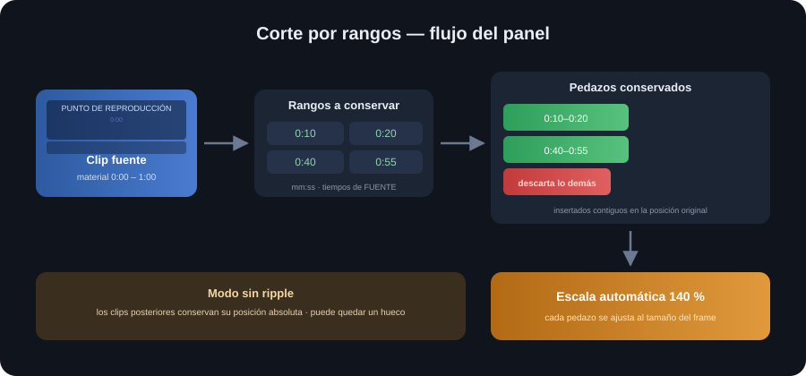
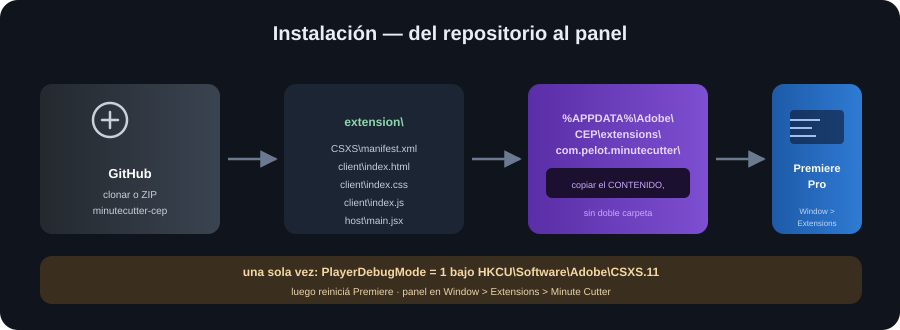

# ⏱️ MinuteCutter — Panel CEP para Premiere Pro

Panel CEP para **Premiere Pro 2022** que recorta rangos de un clip de video **directamente desde el material fuente** (tiempos de fuente, no de timeline) en una sola operación: corta video + audio vinculado, conserva los rangos elegidos como pedazos contiguos, les aplica **escala automática 140 %** y **no mueve el material posterior** (modo sin ripple).



| Badge | Estado |
|---|---|
| Repositorio | [Eduardo12Pacheco/minutecutter-cep](https://github.com/Eduardo12Pacheco/minutecutter-cep) · público |
| Versión estable actual | `v1.1.0` (modo sin ripple) |
| Versión anterior | `v1.0.0` (corte con cierre de hueco / ripple) |
| Premiere Pro | 22.x (verificado en 22.5.0) · manifest `[22.0, 22.9]` |
| Runtime | CEP 12 / **CSXS 11** |
| Sistema | Windows |

---

## 🚀 Quick Start

1. Cerrá Premiere Pro por completo.
2. Copiá el contenido de `extension\` a la carpeta de extensiones de usuario:

   ```powershell
   $src = Join-Path (Get-Location) "extension"
   $dest = "$env:APPDATA\Adobe\CEP\extensions\com.pelot.minutecutter"
   New-Item -ItemType Directory -Path $dest -Force | Out-Null
   Copy-Item -Path (Join-Path $src "*") -Destination $dest -Recurse -Force
   ```

3. Habilitá extensiones CEP sin firmar (una sola vez):

   ```powershell
   New-Item -Path "HKCU:\Software\Adobe\CSXS.11" -Force | Out-Null
   Set-ItemProperty -Path "HKCU:\Software\Adobe\CSXS.11" -Name "PlayerDebugMode" -Value "1"
   ```

4. Reabrí Premiere Pro y abrí el panel en **Window > Extensions > Minute Cutter**.

**Resultado esperado:** el panel muestra `Clip: <nombre> — Duración: <mm:ss>` y el botón **Cortar** habilitado. Al cortar, el panel responde `Corte realizado en N pedazo(s) sin mover material posterior`.

---

## 🔍 Qué hace

- **Tiempos de fuente:** los rangos `Inicio`/`Fin` son relativos al material del clip (su `inPoint`/`outPoint`), **no** a la posición en el timeline. Ej. `0:10` → `0:20` conserva los segundos 10 a 20 del material, sin importar dónde arranca el clip.
- **Audio vinculado:** el audio acoplado al video seleccionado se corta junto con este.
- **Corte por rangos:** se crea un subclip por cada rango conservado; el resto del material se descarta.
- **Escala 140 %:** cada pedazo se ajusta al tamaño del frame y se le aplica `Scale = 140`.
- **Modo sin ripple:** los clips posteriores (V1/A1/V2/A2) **conservan su posición absoluta** — no se ejecuta `TrackItem.move` sobre ellos. Los pedazos quedan contiguos en la posición original y **puede quedar un hueco** tras el último pedazo.

### Paso a paso del corte

1. Crear un *subclip* por cada rango conservado (basado en el material fuente del clip).
2. Eliminar el clip original (video y audio vinculado).
3. Insertar los subclips en la posición original, contiguos entre sí.
4. Aplicar escala automática 140 % a cada pedazo.
5. No correr los clips posteriores: conservan sus posiciones absolutas (posible hueco).



---

## 🛠️ Instalación para humanos

### 1. Obtener el código

**Opción A — clonar con git**

```powershell
git clone https://github.com/Eduardo12Pacheco/minutecutter-cep.git
cd minutecutter-cep
```

**Opción B — ZIP sin git**

1. Entrá a `https://github.com/Eduardo12Pacheco/minutecutter-cep`.
2. Botón verde **Code ▾** → **Download ZIP**.
3. Descomprimí el archivo. Queda una carpeta tipo `minutecutter-cep-main\`. **Usá esa carpeta como raíz** para los pasos siguientes.

### 2. Instalar en Premiere

> ⚠️ **Cuidado con la doble carpeta:** copiá el **CONTENIDO** de `extension\`, no la carpeta `extension` en sí. Si copiás la carpeta entera queda `...\com.pelot.minutecutter\extension\...` y el panel no aparece. El manifest debe quedar en `%APPDATA%\Adobe\CEP\extensions\com.pelot.minutecutter\CSXS\manifest.xml`.

Ejecutá desde la **raíz del proyecto**:

```powershell
$src = Join-Path (Get-Location) "extension"
$dest = "$env:APPDATA\Adobe\CEP\extensions\com.pelot.minutecutter"
New-Item -ItemType Directory -Path $dest -Force | Out-Null
Copy-Item -Path (Join-Path $src "*") -Destination $dest -Recurse -Force
```

**Verificación** — debe devolver `True`:

```powershell
Test-Path "$env:APPDATA\Adobe\CEP\extensions\com.pelot.minutecutter\CSXS\manifest.xml"
```

Estructura instalada correcta:

```
%APPDATA%\Adobe\CEP\extensions\com.pelot.minutecutter\
├── CSXS\manifest.xml
├── client\index.html, index.css, index.js
└── host\main.jsx
```

### 3. Habilitar PlayerDebugMode (una sola vez)

```
HKEY_CURRENT_USER\Software\Adobe\CSXS.11
Valor: PlayerDebugMode  (REG_SZ)  =  1
```

**Opción A — `reg.exe`:**

```powershell
reg add "HKCU\Software\Adobe\CSXS.11" /v PlayerDebugMode /t REG_SZ /d 1 /f
```

**Opción B — PowerShell:**

```powershell
New-Item -Path "HKCU:\Software\Adobe\CSXS.11" -Force | Out-Null
Set-ItemProperty -Path "HKCU:\Software\Adobe\CSXS.11" -Name "PlayerDebugMode" -Value "1"
```

**Verificación** — debe devolver el valor `1`:

```powershell
Get-ItemProperty -Path "HKCU:\Software\Adobe\CSXS.11" -Name "PlayerDebugMode"
```

### 4. Reiniciar Premiere

1. Premiere debe estar **completamente cerrado** durante la copia y el registro (no alcanza con cerrar la ventana del proyecto).
2. Reabrí Premiere Pro.
3. Abrí **Window > Extensions > Minute Cutter** (el manifest usa `AutoVisible`).

---

## 🤖 Instalación para agentes

Instrucciones literales para que un agente de IA realice la instalación en una máquina nueva:

1. **Clonar o descargar** el repositorio: `git clone https://github.com/Eduardo12Pacheco/minutecutter-cep.git` (o descargar el ZIP y usar la carpeta descomprimida como raíz del proyecto).
2. **Leer el README completo** (este archivo), en especial las secciones *Instalación para humanos* y *Limitaciones*.
3. **Ejecutar el checklist** de verificación:
   - [ ] Premiere Pro cerrado por completo.
   - [ ] Contenido de `extension\` copiado a `%APPDATA%\Adobe\CEP\extensions\com.pelot.minutecutter\` (**sin doble carpeta**).
   - [ ] `Test-Path "$env:APPDATA\Adobe\CEP\extensions\com.pelot.minutecutter\CSXS\manifest.xml"` devuelve `True`.
   - [ ] `PlayerDebugMode = 1` bajo `HKCU\Software\Adobe\CSXS.11`.
   - [ ] Premiere reiniciado; panel visible en Window > Extensions.
4. **Validar el manifest**: `extension/CSXS/manifest.xml` debe declarar `Host Name="PPRO" Version="[22.0,22.9]"` y `RequiredRuntime Name="CSXS" Version="11.0"`, con `ExtensionBundleId="com.pelot.minutecutter"`.
5. **Instalar** siguiendo el PowerShell exacto de la sección *Instalación para humanos* (pasos 2 y 3), ejecutado desde la raíz del proyecto.
6. **No tocar archivos fuera del destino**: no modificar `%APPDATA%\Adobe\CEP\extensions\com.pelot.minutecutter\` ni el registro más allá de `CSXS.11\PlayerDebugMode`. No escribir en la carpeta del proyecto ni en el repositorio durante la instalación.

---

## ⏱️ Formato de tiempos y ejemplos

- Formato `mm:ss` (ej. `1:20`, `2:05`). Acepta más segmentos (ej. `1:20:30` = 1 h 20 m 30 s).
- **Tiempos de FUENTE**: relativos al material del clip, no a la posición en el timeline.
- `Fin` debe ser mayor que `Inicio` y no puede superar la duración del material fuente.

| Ejemplo | Rangos | Resultado |
|---|---|---|
| Simple | `0:10` → `0:20` | Un pedazo de 10 s conservado (segundos 10–20 de la fuente) |
| Multi-rango | `0:10`–`0:20` y `0:40`–`0:55` | Dos pedazos contiguos: 10 s y 15 s, insertados en la posición original |
| Conservar todo el clip | `0:00` → duración total | Un pedazo = el clip original completo |

> 💡 **Prueba recomendada:** hacé tu primera prueba con `0:10` → `0:20` sobre un proyecto de prueba o una **copia** del proyecto. No lo pruebes sobre el único original ni sobre proyectos duplicados con el mismo material (pueden resolverse mal). Mantené un backup antes de cortar.

---

## ⚠️ Limitaciones

- **Plataforma:** Windows + Premiere Pro **2022 (22.x)** + CEP **11**. El manifest declara `[22.0, 22.9]`; no se verifica en otras versiones.
- **Velocidad:** solo clips a **1x (100 %)**. No se admiten velocidad 0, velocidad distinta de 1x ni clips en **reversa**.
- **Selección de Proyecto (BIN):** sin instancia en el timeline no se puede cortar; primero debe existir una instancia. El panel avisa.
- **Audio sincronizado:** si hay audio sincronizado no seleccionado en la posición del clip, el corte se rechaza y se pide seleccionar video + audio juntos.
- **Operación estable sin ripple:** el corte **no** requiere `TrackItem.move`; los clips posteriores no cambian de posición y puede quedar un hueco. Si esperabas que el material posterior se corriera, esta versión no lo hace.
- **APIs del host:** el corte depende de APIs de ExtendScript (crear subclips, remover/insertar clips). Si el build no las expone, se aborta con mensaje claro y sin tocar el timeline (o reintentando restaurar, con aviso de usar Ctrl+Z si el rollback quedó incompleto).
- **Build no oficial:** Premiere Pro es software cerrado; este panel usa APIs de ExtendScript que pueden variar entre builds. Si alguna API no se comporta como se espera, el panel reporta el error y no deja el timeline a medias.

---

## 🩺 Troubleshooting

| Síntoma | Causa probable | Solución |
|---|---|---|
| El panel no aparece en Window > Extensions | Doble carpeta `extension\extension` | Verificá la estructura instalada y recopíá el contenido |
| `Test-Path` da `False` | Copia incompleta o destino equivocado | Repetí el paso de copia desde la raíz del proyecto |
| El panel no carga el host | Falta `host\main.jsx` en la instalación | Reinstalá y reiniciá Premiere |
| `PlayerDebugMode` no aplica | Clave bajo otra versión de CSXS | Verificá que esté bajo **`CSXS.11`** (Premiere 2022) |
| `Error: timeout del host` | El corte tardó más de lo esperado | Revisá el timeline; el corte pudo no completarse |
| `Error: ... velocidad 1x` | Clip con velocidad distinta de 100 % | Cambialo a 100 % y reintentá |
| `Error: ... reversa` | Clip en reversa | No se admite reversa en esta versión |
| `Error: ... supera la duración` | Rango fuera del material fuente | Ajustá el rango a la duración real |
| Hueco tras el corte | Comportamiento esperado sin ripple | Uní manualmente o usá `v1.0.0` (con ripple) |

**Diagnóstico del panel:** muestra su estado en la barra inferior y en la línea del clip. Mensajes comunes:

| Situación | Mensaje |
|---|---|
| Clip detectado y listo | `Clip: <nombre> — Duración: <mm:ss>` + botón **Cortar** habilitado |
| Sin selección | `Sin clip seleccionado. Elegí un clip en el timeline o en el proyecto.` |
| BIN sin instancia | `Clip de Proyecto detectado; para cortar, primero debe existir en timeline` |
| Corte exitoso | `Corte realizado en N pedazo(s) sin mover material posterior` (puede incluir aviso de escala) |

---

## 🔄 Backups y rollback

- **Backup del proyecto:** hacé backup del `.prproj` antes de cortar; la herramienta modifica el timeline.
- **Tags publicados:**

  | Tag | Commit | Descripción |
  |---|---|---|
  | `v1.1.0` | actual | Estable actual — modo sin ripple, README completo |
  | `v1.0.0` | `bc152` | Estable anterior — corte con cierre de hueco (ripple) |

- **Volver a una versión estable:**

  ```bash
  git checkout v1.0.0
  ```

  Después de un checkout, re-instalá repitiendo el paso de copia de `extension\` a `%APPDATA%\Adobe\CEP\extensions\com.pelot.minutecutter` y reiniciá Premiere. Para volver al código de la rama principal: `git checkout main`.

---

## 🧑‍💻 Desarrollo y contribución

- **Ramas:** el desarrollo se hace en ramas temáticas (`fix/...`, `feature/...`) y se integra a `main` con merges sin reescribir historia.
- **Tests:** `node tests/harness.js` (harness de comportamiento no-ripple). También `npm test`.
- **Hygiene:** no commitear **backups**, archivos temporales ni **secretos**. El `.gitignore` ya excluye `node_modules/`, `*.bak`, `.env`, backups y logs. Revisá `git status` y `git diff` antes de cada commit.
- **Commits:** mensajes convencionales (`feat`, `fix`, `docs`, `chore`, `merge`).

### Historial de releases

| Versión | Fecha | Cambios |
|---|---|---|
| `v1.1.0` | 2026 | Modo **sin ripple** como comportamiento estable (conserva posición absoluta de clips posteriores); tests de harness; README con guía completa. |
| `v1.0.0` | 2026 | Release pública estable: corte por rangos desde material fuente, audio vinculado, escala 140 %, cierre de hueco con ripple. |

---

## 🏗️ Estructura del repo

```
minutecutter-cep/
├── extension/
│   ├── CSXS/manifest.xml   # panel PPRO 22.x, CSXS 11, UI "Minute Cutter"
│   ├── client/             # panel (index.html, index.css, index.js)
│   └── host/main.jsx       # lógica ExtendScript (ES3)
├── docs/
│   ├── flow.svg            # flujo del corte (diagrama)
│   └── installation.svg    # flujo de instalación (diagrama)
├── tests/harness.js        # tests del harness no-ripple
├── .gitignore
├── README.md
└── package.json            # tooling de dev (scaffold) + npm test
```

> El path del host (`host/main.jsx`) se deriva en runtime desde la URL del panel; no quedan rutas de usuario hardcodeadas.

---

## ⚖️ Licencia

No se ha definido una licencia pública todavía: este repositorio es código propio de distribución y, hasta que se decida lo contrario, se publica **sin licencia formal**. Al no tener licencia, no se concede permiso explícito de copia, modificación o redistribución más allá de lo que indica la ley aplicable (reservados todos los derechos). Se puede clonar y usar el panel para instalarlo y probarlo, pero no redistribuirlo como producto propio.

---

## 🙌 Aviso honesto

Este panel funciona con APIs de ExtendScript de **Premiere Pro**, que es software cerrado. Estas APIs **no son públicas ni oficiales** y pueden variar entre builds de Adobe. La extensión se probó en **Premiere Pro 22.5.0** y puede comportarse distinto en otros builds o versiones; siempre validá sobre un proyecto de prueba y manteniendo backups.
